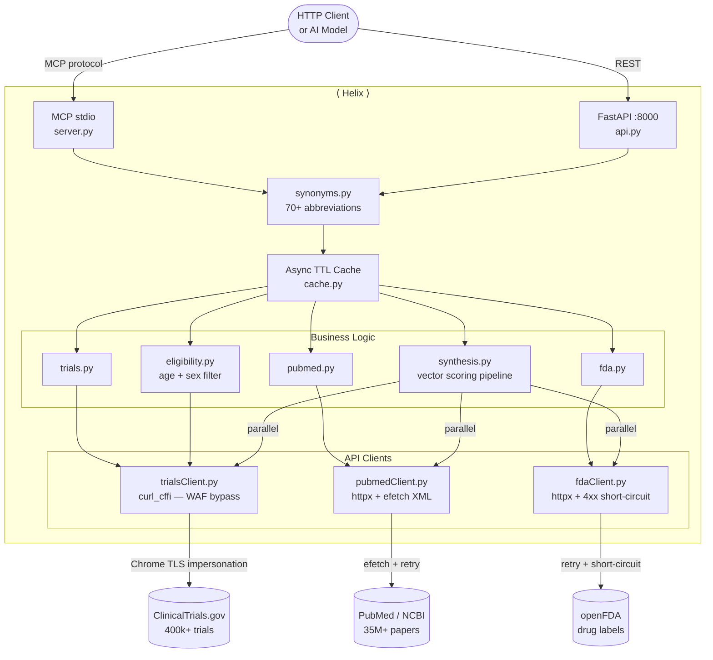

<div align="center">

<br/>

# ⟨&nbsp;Helix&nbsp;⟩

**Clinical evidence synthesis engine — free, no API key, production-grade.**

<br/>

[](https://github.com/Al1Abdullah/Helix/actions/workflows/ci.yml)&nbsp;
[](https://python.org)&nbsp;
[](LICENSE)&nbsp;
[](https://modelcontextprotocol.io)&nbsp;
[](CHANGELOG.md)&nbsp;
[](#development)&nbsp;
[](#data-sources)

<br/>

Give **any AI model** — or any HTTP client — structured, scored access to the world's three largest free health databases. **In a single call.**

<br/>

|  400,000+ Clinical Trials |  35M+ PubMed Papers |  FDA Drug Labels |  < 4 s Response |
|:---:|:---:|:---:|:---:|
| ClinicalTrials.gov live data | Full abstracts via efetch | openFDA drug information | All 3 databases in parallel |

<br/>

</div>

---

## What makes it different

Most clinical search tools are black boxes — a query goes in, a list comes out. Helix shows its work:

| | Feature | What it means for you |
|:---:|---|---|
|  | **Abbreviation expansion** | Type `T2D` or `NSCLC` — Helix silently resolves 70+ medical abbreviations before touching any API. The raw term never reaches upstream services. |
|  | **Explainable scoring** | Every trial gets a four-component `score_vector`: condition match, age-window centrality, evidence support, phase maturity. You know *exactly* why trial #1 ranked above trial #2. |
|  | **Transparent exclusions** | Ineligible trials don't quietly disappear. They appear in `excludedTrials` with a precise rejection reason: `age 72 above max 65` or `sex mismatch: trial=MALE, patient=FEMALE`. |
|  | **Dual interface** | REST API for any language or stack. MCP server for AI models — Claude Desktop, Copilot, Cursor, or anything else that speaks MCP. |
|  | **Zero credentials** | No API keys, no sign-ups, no rate-limit spreadsheets. `pip install` and it works. |

---

## Quick Start

**Three ways to run Helix — pick the one that fits your workflow:**

### 1 · pip

```bash
git clone https://github.com/Al1Abdullah/Helix.git
cd Helix
pip install -e .
helix-api
```

Open **[http://localhost:8000/docs](http://localhost:8000/docs)** — interactive Swagger UI with every endpoint, request schema, and live test console.

### 2 · Docker

```bash
docker compose up   # → http://localhost:8000/docs
```

### 3 · MCP (Claude Desktop)

Add to `claude_desktop_config.json`:

```json
{
  "mcpServers": {
    "helix": { "command": "helix" }
  }
}
```

Then ask Claude: *"Find clinical trials for a 52-year-old female with NSCLC"* — Helix handles the rest.

---

## Demo

```bash
curl -X POST http://localhost:8000/synthesize \
  -H "Content-Type: application/json" \
  -d '{"condition": "T2D", "age": 45, "sex": "MALE"}'
```

```json
{
  "clinicalInsight": {
    "condition": "Type 2 Diabetes",
    "expanded_from": "T2D",
    "total_trials": 16,
    "top_score": 94.0,
    "average_score": 77.66
  },
  "trialProfiles": [
    {
      "id": "NCT05099770",
      "title": "Proact: A Study of REACT in Subjects With Type 2 Diabetes...",
      "phase": ["PHASE3"],
      "final_score": 94.0,
      "score_vector": {
        "condition_match": 1.0,
        "eligibility_fit": 0.8,
        "evidence_support": 1.0,
        "trial_phase_maturity": 1.0
      },
      "risk_flags": []
    }
  ],
  "excludedTrials": [
    {
      "id": "NCT00000042",
      "title": "Women-Only Cardiovascular Study",
      "exclusion_reason": "sex mismatch: trial=FEMALE, patient=MALE"
    }
  ]
}
```

Notice: `expanded_from: "T2D"` — the API surface is self-documenting. The caller always knows whether abbreviation resolution fired.

---

## REST API Reference

```bash
helix-api   # starts on :8000
```

| Method | Endpoint | Description |
|--------|----------|-------------|
| `GET` | `/health` | Live connectivity ping across all 3 upstream APIs with per-service latency |
| `GET` | `/synonyms` | Full sorted map of 70+ abbreviations → canonical condition names |
| `GET` | `/score-weights` | Current scoring formula, weight vector, and component descriptions |
| `POST` | `/synthesize` | **Core endpoint.** Cross-database synthesis: scored trial profiles + exclusion list |
| `POST` | `/eligibility` | Pre-filter trials by condition, age, and sex without full scoring |
| `GET` | `/trials` | ClinicalTrials.gov keyword search (`?sex=MALE\|FEMALE` supported) |
| `GET` | `/papers` | PubMed keyword search with full abstracts |
| `GET` | `/drugs` | openFDA drug label lookup by brand or generic name |
| `GET` | `/cache/stats` | Inspect TTL cache hit rates and key counts |
| `DELETE` | `/cache` | Flush all in-memory caches |

> **Input validation:** `age` is clamped to `[0, 130]`. `condition` must be `1–300` characters. Violations return HTTP `422` with a structured error object — never a silent failure.

---

## MCP Tools

| Tool | Description |
|------|-------------|
| `synthesize_evidence` | Full cross-database synthesis with scored, explainable trial profiles |
| `find_trials` | ClinicalTrials.gov search (sex filter supported) |
| `search_papers` | PubMed topic search with optional year range; returns full abstracts |
| `lookup_drug` | FDA drug label lookup by brand or generic name |
| `match_eligibility` | Fast age + sex pre-filter — no scoring overhead |
| `health_check` | Live upstream API connectivity and latency report |

---

## Scoring Model

```
final_score = 100 × (
    0.35 × condition_match       ←  token overlap between condition and trial title
  + 0.30 × eligibility_fit       ←  age-window centrality  [center=1.0, edge=0.5]
  + 0.20 × evidence_support      ←  fraction of PubMed hits that match condition terms
  + 0.15 × trial_phase_maturity  ←  Phase 3/4 = 1.0 · Phase 2 = 0.6 · Phase 1 = 0.3
)
```

**Age-window centrality** is the key design decision. A patient at the exact center of a trial's age window scores `1.0`. At the outer boundary: `0.5`. Open enrollment (no age restriction): `0.75`. Hard eligibility is already enforced before scoring — the centrality score measures *how well* a patient fits, not *whether* they qualify.

**Risk flags** are attached to any profile where a sub-score falls below a meaningful threshold:

| Flag | Trigger condition |
|------|-------------------|
| `LOW_CONDITION_MATCH` | `condition_match < 0.2` |
| `EARLY_STAGE_TRIAL` | `trial_phase_maturity ≤ 0.3` |
| `LOW_EVIDENCE_SUPPORT` | `evidence_support < 0.1` |

Full audit trail available per-trial via `score_vector` (normalized sub-scores) and `explainability_vector` (raw counts, penalties) in every synthesis response.

---

## Architecture



<details>
<summary><b>Module map</b></summary>

```
src/helix/
├── api.py              FastAPI REST server (:8000)
├── server.py           MCP server (stdio transport)
├── models.py           Pydantic v2 domain schemas
├── cache.py            Async TTL cache with per-tool TTLs
├── logger.py           Structured JSON logging → stderr
├── config/
│   ├── weights.py          Scoring weight constants
│   └── fda / pubmed / trials.py  Base URLs and limits
├── clients/
│   ├── trialsClient.py     curl_cffi Chrome TLS impersonation (WAF bypass)
│   ├── pubmedClient.py     httpx + exponential retry + efetch full abstracts
│   └── fdaClient.py        httpx + retry + 4xx short-circuit
├── tools/
│   ├── synthesis.py        Cross-database vector scoring pipeline
│   ├── eligibility.py      Hard age + sex gate
│   └── trials / pubmed / fda / health.py
└── utils/
    ├── formatter.py        API response normalizer
    └── synonyms.py         70+ condition abbreviation mappings
tests/
├── unit/           79 assertions — zero network, fully CI-safe
└── tools/          Live smoke tests against real upstream APIs
```

</details>

---

## Data Sources

| Source | Records | API Key |
|--------|---------|---------|
| [ClinicalTrials.gov](https://clinicaltrials.gov/api/v2) | 400,000+ trials | Not required |
| [PubMed / NCBI](https://www.ncbi.nlm.nih.gov/home/develop/api/) | 35M+ papers | Optional — raises rate limit from 3 → 10 req/s |
| [openFDA](https://open.fda.gov/apis/) | Drug labels | Not required |

> To add a PubMed API key, copy `.env.example` to `.env` and fill in `NCBI_API_KEY`. Everything else works out of the box with no configuration.

---

## Development

```bash
# Unit tests — no network calls, runs in CI
pytest tests/unit/

# Live integration tests — calls real APIs
pytest tests/tools/

# Full suite
pytest
```

The unit suite covers age-window centrality math, sex exclusion transparency, abbreviation expansion edge cases, boundary ages (0 and 130), cache TTL hygiene, and scorer correctness — 79 assertions, zero external dependencies.

```bash
# Health check — verify all upstream APIs are reachable
curl http://localhost:8000/health
```

---

## License

MIT — see [LICENSE](LICENSE).
